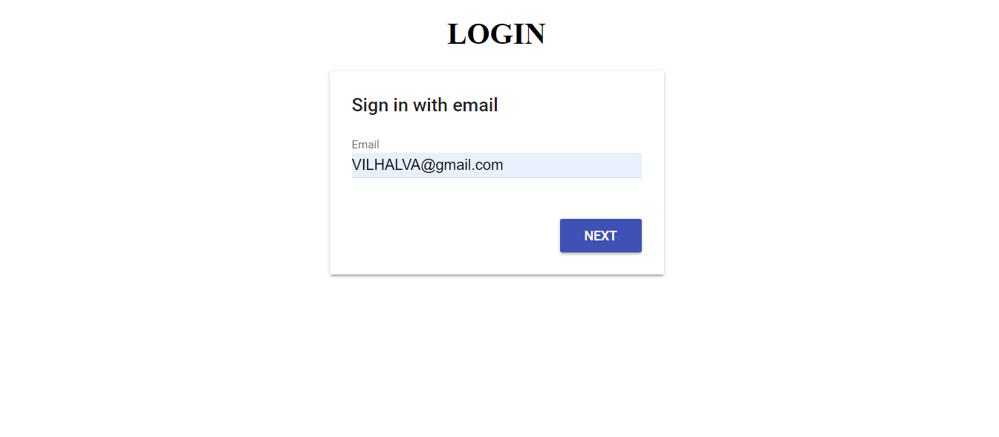
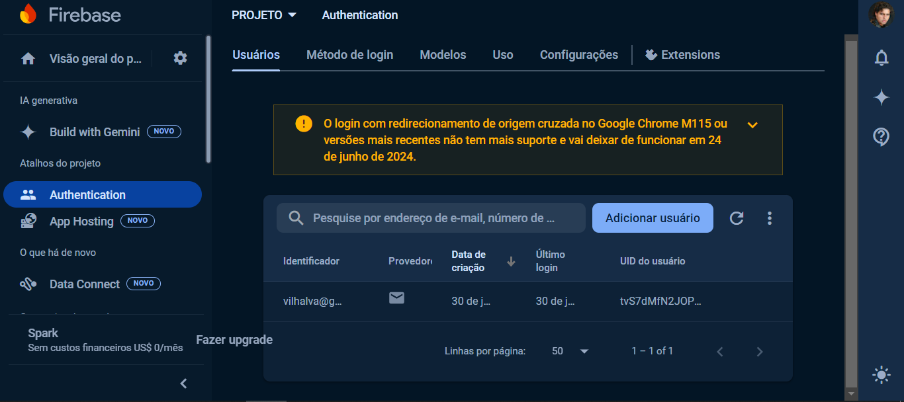

# FIREBASE LOGIN
👨‍🏫APP DE CADASTRO E LOGIN COM FIREBASE CDN!

 <br> 
 <br> 
 <br> 
 <br> 

## DESCRIÇÃO:
Este aplicativo é uma página de login que utiliza Firebase para autenticação. Ele é configurado para fornecer uma interface de login amigável com o Firebase Authentication UI, que facilita o processo de login através de uma interface pré-estilizada. A página é configurada para se conectar ao Firebase e utilizar o Firebase Authentication UI para gerenciar o fluxo de autenticação.

## FUNCIONALIDADES:
1. **Interface de Login**:
   - Exibe um título "LOGIN" no centro da página.
   - Inclui um contêiner (`<div id="firebaseui-auth-container"></div>`) onde o Firebase Authentication UI será renderizado.

2. **Autenticação com Firebase**:
   - Utiliza a biblioteca Firebase Authentication UI (`firebaseui`) para fornecer uma interface de login fácil de usar.
   - Permite o login usando vários provedores de autenticação, como Google, Facebook, e-mail/senha, entre outros.

## EXECUTANDO O PROJETO:
1. **Criar o app no Firebase**
   1. **Acesse o Firebase Console**:
      - Vá para [Firebase Console](https://console.firebase.google.com/).

   2. **Crie um Novo Projeto**:
      - Clique em "Adicionar projeto".
      - Dê um nome ao seu projeto e siga as instruções para configurá-lo.
      - Quando solicitado, você pode optar por habilitar o Google Analytics para seu projeto (opcional).

   3. **Configuração do Projeto**:
      - Após a criação do projeto, você será redirecionado para o painel do projeto.
      - Clique no ícone de configurações ao lado do nome do projeto e selecione "Configurações do projeto".
      - No menu de configurações, selecione "Suas apps" e clique no ícone do Firebase para web (</>) para criar um novo app web.
      - Dê um nome ao app e clique em "Registrar app".

   4. **Obter Configuração do Firebase**:
      - Após registrar o app, você verá as configurações do Firebase, incluindo o `apiKey`, `authDomain`, `projectId`, etc.
      - Copie essas informações. Você precisará delas para configurar o Firebase na sua aplicação React.

   5. **Configurar Firebase no Projeto**:
      - Adicione a configuração do Firebase no arquivo `./CODIGO/fireBase.js`, usando as informações copiadas do console do Firebase. O código deve ser semelhante ao seguinte:
      ```javascript
      // fireBase.js

      var fireBase = fireBase || firebase;
         var hasInit = false;
         var config = {
            apiKey: "SUA_API_KEY",
            authDomain: "SEU_AUTH_DOMAIN",
            databaseURL: "SEU_DATABASE_URL",
            projectId: "SEU_PROJECT_ID",
            storageBucket: "SEU_STORAGE_BUCKET",
            messagingSenderId: "SEU_MESSAGING_SENDER_ID"
         };

         if(!hasInit){
            firebase.initializeApp(config);
            hasInit = true;
         }
      ```

2. **Interagindo com o Aplicativo:**
   1. **Abrir a Página de Login**:
      - Carregue o arquivo `./CODIGO/index.html` no seu navegador. A página deve exibir um formulário de login gerado pelo Firebase Authentication UI.

   2. **Realizar Login**:
      - Escolha o método de autenticação desejado (por exemplo, Google, Facebook, e-mail/senha) e siga as instruções para autenticar-se.

   3. **Redirecionamento Após Login**:
      - Após um login bem-sucedido, o usuário será redirecionado para a URL configurada (`signInSuccessUrl`), que pode ser a página principal do aplicativo ou outra página definida.

## NÃO SABE?
- Entendemos que para manipular arquivos em `HTML`, `CSS` e outras linguagens relacionadas, é necessário possuir conhecimento nessas áreas. Para auxiliar nesse aprendizado, oferecemos cursos gratuitos disponíveis:
* [CURSO DE HTML E CSS](https://github.com/VILHALVA/CURSO-DE-HTML-E-CSS)
* [CURSO DE JAVASCRIPT](https://github.com/VILHALVA/CURSO-DE-JAVASCRIPT)
* [CONFIRA MAIS CURSOS](https://github.com/VILHALVA?tab=repositories&q=+topic:CURSO)

## CREDITOS:
- [PROJETO CRIADO PELO "Gabriels-Lab"](https://github.com/Gabriels-Lab/Firebase-Login-Example)
- [PROJETO EDITADO PELO VILHALVA](https://github.com/VILHALVA)


